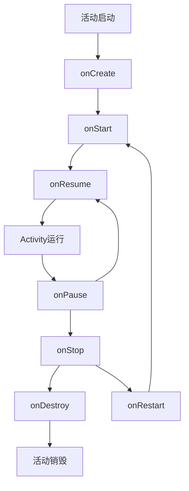
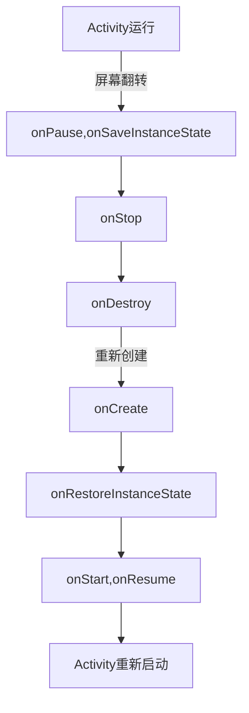

@[toc]
# 前言
Activity作为安卓四大组件之一，平常我们接触得最多得也是activity，所以很有必要详细了解一下他的详细生命周期。这篇文章定位是有一点安卓基础的，所以还完全不了解的可以先去学习一下activity。这篇文章主要是讲活动的生命周期。
活动的生命周期，人有胎儿期，青春期，老年期一样，活动同样有他的各种生命状态。我们出生会哭，进入成年期会有成人礼。活动也一样，每进入一个状态都会回调相应的方法。对于我们来说，活动周期就是活动会在活动具体哪个时候会回调哪一些方法，然后我们可以重写这一些方法，来实现我们的功能。所以我们得具体了解究竟什么时候调用什么方法。例如在onCreate方法中初始化，在destroy中释放内存等等。
那接下来就看看他的具体生命周期。

# 活动的状态
首先得了解一下活动的状态。我个人的理解把活动分为四个状态：后台状态，暂停状态，运行状态和销毁状态。

1. 停止状态：这个状态表示活动未进入前台，我们看不到也无法交汇。切换界面活动都会在后台。如果内存紧张的话有可能被回收。就像我们有时候打游戏切换到微信回了一下信息，回来的时候卧槽怎么把我游戏退了，就是这样。
2. 运行状态：这个不用多讲，当你在交汇的这个活动就是运行状态。
3. 暂停状态：当弹出一个提示框，我们回发现无法与原来的界面交汇了，就是只能点那个提示框。当一个活动位于栈顶，也就是你看的见他，但是你没办法操作他，这个时候就是属于暂停状态。
4. 销毁状态：就是被移出栈顶的活动，马上就会被回收了。例如你退出一个应用他马上就会被杀了。
# 常规情况下的生命周期
## 典型情况下的生命周期
每个活动正常启动的话都会经历的生命周期如下图

每到一个时间点都会调用相关的方法，接下来一个一个来分析一下这些方法。

1. onCreate：
```java
@Override
    protected void onCreate(Bundle savedInstanceState) {
        super.onCreate(savedInstanceState);
        setContentView(R.layout.activity_main);
    }
```
 这是我们每个活动都会用到的一个方法。他在活动被创建的时候被调用，且只会调用一次。除非被destroy重新创	建。我们一般在这个方法中做一下初始化的事情。例如加载布局资源等等。细心的读者可能会注意到他有一个Bundle参数，这个参数主要是用于保存被异常销毁事的数据的，这个在后面会讲到

2. onStart:顾名思义这个方法表示活动正在启动，这个时候活动界面已经看的见了，但是还不能与用户交汇，简单点说就是你看得到点不了。但是一般速度很快不会让你感受到这个现象，不然就会好像卡死一样了。所以不能在这个方法中做重量级的操作，初始化什么的都放在onCreate。
3. onResume：这个方法表示活动显示在前台了而且也可以用了。onStart和onResume主要配合onPause和onStop方法来使用，下面会讲到。
4. onPause：活动被暂停的时候会调用到。例如一些弹出提示框，看得到界面但是无法进行交汇。一般执行完这个方法后紧接着就会执行onStop方法了。这个方法可以做一些动画的暂停工作等等轻量级的工作，不然弹个提示框都要卡一下用户体验也很差对吧。
如果没有进入onStop这个环节的话，回到原Activity的话，那么就会调用onResume这个方法了

5. onStop：这个方法在活动即将停止的时候调用，同样不能做重量级的工作。一般切换界面，如果内存足够没有被杀死的话，这个活动就会进入停止状态。
6. onRestart：当活动从停止状态回来的时候就会调用这个方法。状态和onStart其实是差不多的，只是为了区分是正常打开的还是从停止状态回来的，可以分别写不同的方法。
7. onDestroy：活动被销毁的时候会调用这个方法。可以做一些资源的释放什么的。但这里要特别强调的一点就是并不是所有情况下活动被销毁都会调用这个方法。例如当你按下返回键回到上个界面，这个当然是会执行这个方法。但是如果你切换到了别的应用或者回到了桌面，这个应用被后台杀死了，那么只有处于栈顶也就是这个应用最后打开的活动会执行destroy方法，其他都不会，需要特别注意一下。


    
## 一些例外情况的生命周期
有一句话叫做用户永远不会按照你的设想去使用软件，活动也一样，总是会出现一些比较不一样的情况。这些情况活动是怎么跑的也来看看：

1. 返回桌面的时候：返回桌面其实就像切换到别的活动是一样的道理，这个时候执行的方法是：onPause --> onStop。
2. 当活动被系统回收再被打开，流程和打开一个新的活动是一样的。
3. 打开新的活动时先执行onPause方法再启动新的活动，onStop会慢一点点执行。

# 异常情况下的生命周期
这里的异常情况主要有两种：一种是放在后台被杀死了，不是我们主动去终结他的生命的，第二种是设备的配置发生了改变，例如屏幕翻转。对于这两种情况我们具体来看一下

## 情况1 ：资源相关的系统配置发生改变
这个资源相关的系统配置怎么说呢。我们的项目目录下不是有drawable-hdpi ，drawable-mdpi，这一类的文件夹，在不同的屏幕尺寸下会获取不同的图片，就像我们手机和平板也是一样有两个不同的配置。平常中我们翻转屏幕时，屏幕尺寸就发生了变化，准确来说时屏幕的长宽比例发生了变化，那么这个时候Activity就会被重建（当然你也可以设置他不重建）。
细心的读者会发现，即使我的屏幕翻转了，活动重建了，可是还是保留着刚刚我操作的内容啊！例如我在输入框输入了Hello World翻转后还是Hello World，不是说活动被重建了吗，为什么这些还存在？
不知道还记不记得onCreate方法中有一个Bundle参数吗？没错，这个参数就是记录之前的数据的。重建的过程和平常的杀死启动活动有一些不一样，看一下：

可以看到最主要的不同就是多了onSaveInstanceState和onRestoreInstanceState这两个方法。
活动在这种异常的情况下被终结生命后，就会调用onSaveInstanceState方法来保存目前的数据，这个方法在onStop方法前调用，但是和onPause方法的前后关系没有必然的关系。然后作为一个Bundle参数传递给重新创建的活动。这个Bundle对象会在onCreate方法中和onRestoreInstanceState中被使用。onRestoreInstanceState这个方法主要就是把刚才的数据还原，执行的次序是在onStart之后。
要注意的一点是，onSaveInstanceState方法只有在活动还会被重建的时候才会被调用。例如你手动把他后台杀了，是不会调用这个方法的。

## 资源内存不足导致活动被杀死
当系统内存不足的时候，系统就会按照优先级的大小去杀死一些活动，并在后续通过上面onSaveInstanceState和onRestoreInstanceState方法来恢复数据。优先级按照状态依次是：运行状态，暂停状态，停止状态。一般最有可能是停止状态的活动被杀了。所以一些后台工作就尽量放在service中防止被杀死
# 总结
讲了这么多的生命周期，其实我也是简单讲了我们在使用中一般会遇到的生命周期。有一些读者可能会有这个疑问：为什么我主动调用了onDestroy方法但是活动却没有被杀死？举个例子，你给一个婴儿举办成人礼，他会马上成人吗？要注意的一点就是，我们所说的这些生命周期的回调方法，本质上他们都是一样的，只是被调用的时间不用。他们只是在活动的不同时间被调用，并不是调用这个方法去推进活动的生命进行。主动销毁活动我们用到的是finish（），而不是onDestroy，要特别注意。

生命周期是活动很重要的一部分，只要了解了他的生命周期我们才可以在准确的时间给他做一些正确的事情。例如你的孩子进入了青春期，你就得跟他说好好学习不要老是想着谈恋爱对吧。我之前自己出过一个低级错误就是在onCreate方法之前使用findViewById，活动都还没创建，怎么找得到布局呢。充分了解这些生命周期后就不会犯这些低级错误了。

我也是一个安卓新手，有哪些地方写的不好还请大佬们指教

·
·
·
##### 参考资料
《Android开发艺术探索》--任玉刚
《第一行代码》--郭霖
