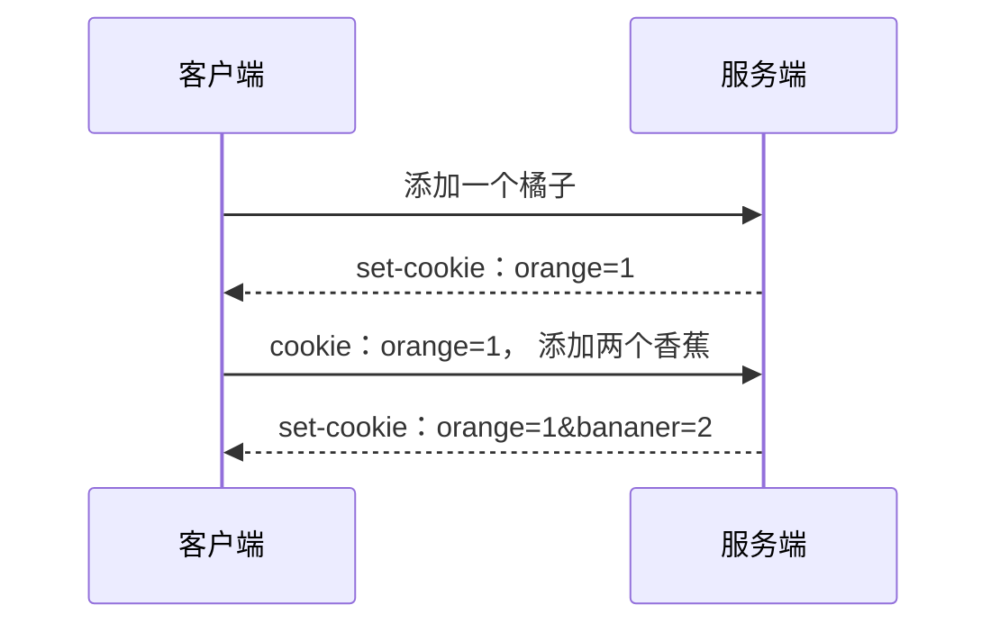
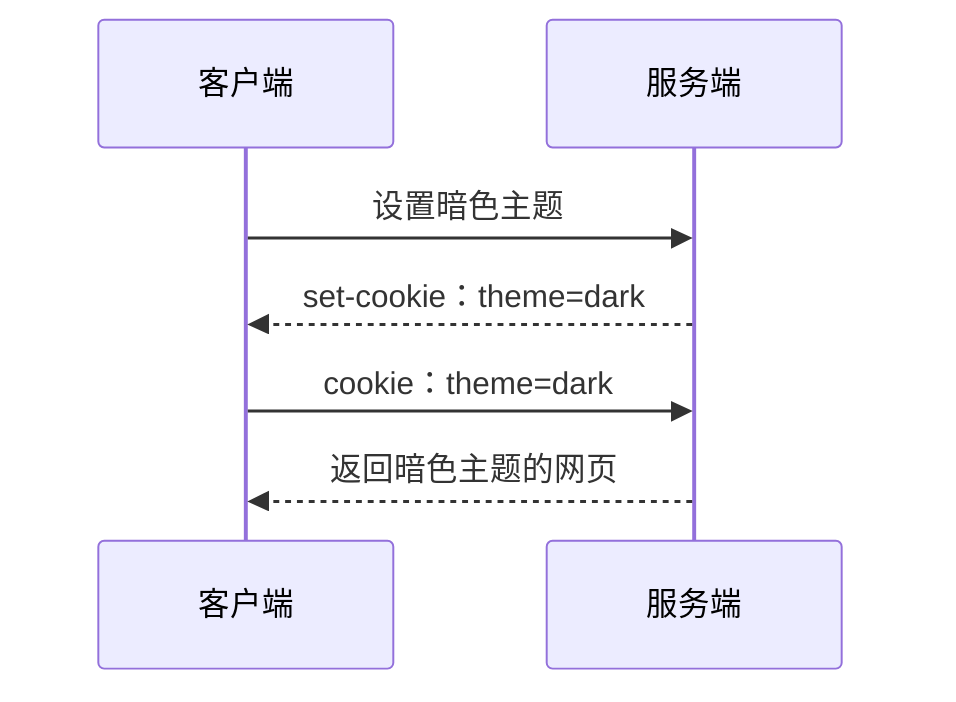
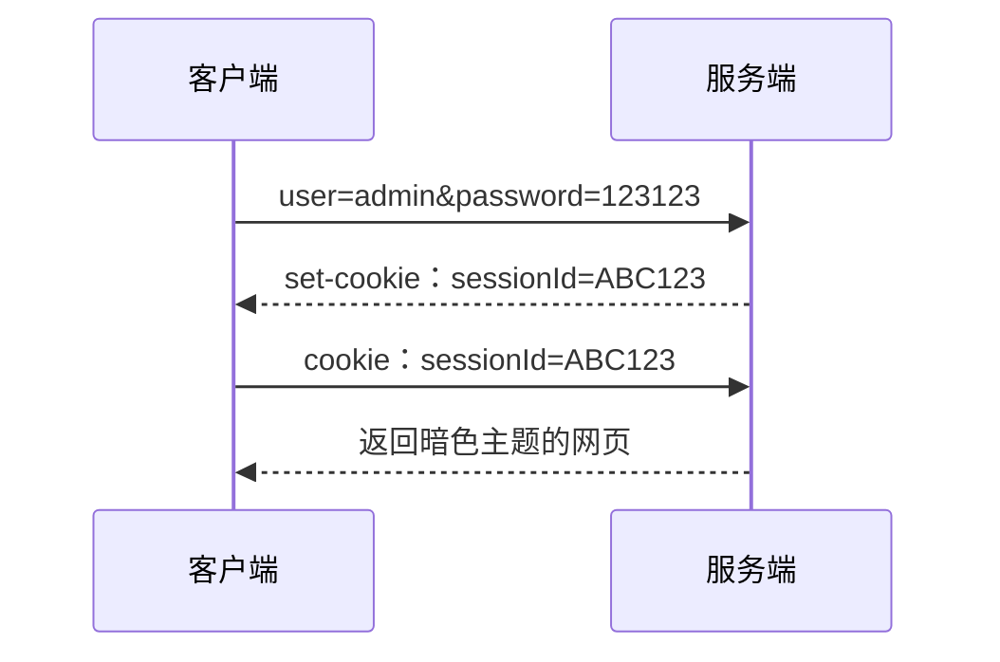

## 前言
很高兴遇见你~

cookie在HTTP1.1版本中被添加，目的是为了解决HTTP的**无状态特性**，使HTTP变得“有状态”。

我们在做android开发，很多时候并不能很好理解cookie的存在价值、优化。这其实正常。Http中文翻译为超文本传输协议，是为web开发的传输协议。而cookie作为其中的一个功能，他的设计自然也是服务于web。为了更好地理解cookie他的本质，需要站在web开发的角度来理解他，具体而言就是使用浏览器网页具体化客户端。

android的发展要比web晚的多。虽然都使用cookie，但cookie相对于android并没有跟web一样有那么多的好处。但cookie也并不是完全没用，例如我们都知道cookie可以实现记住登录状态。

这篇的文章的目的在于帮助android开发者理解cookie的本质是什么，这样我们在使用cookie的时候会更加心里有底。

## 购物车的故事
我们都知道，HTTP是一个无状态的协议。无状态体现在每一次的请求与响应都是独立的，他们之间不会互相记录、互相影响。


嗯？我们在后端不是会维护购物车的状态，提供api给客户吗？是的，可以有，我们后端完全可以使用数据结构来存储购物车信息。但这不属于HTTP的范畴了，单纯的HTTP是无法实现这样的功能的，是吧？HTTP的每一次请求都是独立、不互相影响的，他不会记得上一次访问发送了什么返回了什么。

为了记住操作状态，http设计者在请求头中附加一些信息，来识别我们的操作状态：


客户端每次操作购物车，服务端都会为其生成一个字段，并把这个字段发送给客户端。这个字段存储了客户端前面的操作状态，下次客户端请求服务端的时候只需要把这个字段附加在请求头中，服务端通过解析这个字段的内容，就知道前面的请求都做了什么。

例如上图，客户端添加了一个橘子，服务端生成 【orange=1】 并发挥给客户端存储。客户端下一次操作只需要把 【orange=1】 附加在请求头中，服务端就知道客户已经添加一个橘子在购物车了。

到这里已经很明显了，这个字段就是**cookie**。

**cookie由服务端生成，在客户端中存储；客户端每次请求附加上cookie，服务端通过解析cookie的内容实现状态记录**。

整个cookie的机制中，客户端做的事情很简单：**存储cookie，附加cookie**。客户端不参与cookie的生成，也不参与cookie的修改。而服务端则负责**cookie的生成与解析**，但是不负责存储。

## cookie的实现

cookie在HTTP中通过两个头部字段来实现：**cookie和set-cookie**。

`set-cookie`在响应报文中附带，告知客户端需要存储该cookie。例如`set-cookie:orange=1`。`cookie`是请求报文头部的一个字段，附带上服务端生成的cookie，例如`cookie:orange=1`。




在cookie机制中，客户端和服务端都必须各司其职。

- 客户端，具体而言就是浏览器，他需要自动把一个网站的生成的cookie存储下来，下一次请求自动把cookie附加在请求头中。
- 服务端，在收到cookie字段时，需要自动解析并响应对应的结果。如收到orange=1必须自动解析出来添加了一个橘子，再次添加香蕉就是orange=1&bananer=2。

同时，cookie是可以拥有多个的，也就是可以不止有一个cookie，这样一个网站就可以使用cookie同时记录多个状态。我这里我们使用postman看一下百度网站的cookie：


可以看到百度返回了多达6个set-cookie。此外，我们可以通过浏览器来查看一个网站的cookie：


可以看到百度这个网站累积使用多达37个cookie。点击cookie就可以查看具体的内容了。

同时需要注意的是，**cookie一般不会明文在网络中传输，而是会进行加密**。这在早期没有https的情况下是非常重要的，否则网络中任何节点都有可能劫持到我们的cookie。上面再postman中百度网站的Set-Cookie字段就可以很明显看的出来是经过了加密。

下面我们再通过两个例子来进一步理解cookie。


## 主题偏好功能

有一些网站具有的一个功能是：不需要登录，但是却可以记住我们的选择的主题，例如暗色或亮色；下一次访问还是我们上次的选择。我们当然可以在后端为每一个ip和端口记录选择结果，但越来越多的访问量占用的空间很大、查询的性能也收到了影响。这个时候就轮到cookie上场了，使用cookie即可更加轻量级地实现这个功能。他的功能模型如下图：


当我们设置主题的时候，服务端会生成一个主题偏好的cookie交给我们存储。下一次只需要把cookie附加在请求头中，服务端解析cookie中的内容，就可以返回对应主题的网页了。相比与在服务端使用数据结构来存储用户的信息，这种方式是不是更加轻量、更加简单？且无需登录注册既可以记住自己的主题偏好。

这种功能在android中似乎不太实用，因为我们的主题使用的是本地的配置，界面的设计内容也都是存储在本地，因而无需服务端来为我们记住主题偏好问题。

但站在web的角度这个功能就非常实用了。网页的具体内容都是存储在服务端，而浏览器只负责渲染界面。这个时候需要cookie来告诉服务端，上次我选择了什么样的主题，这次你也给我返回一样主题的网页界面。

## 记住登录状态

嘿，登录注册，我们android工程师，就很好理解了。毕竟第一次接触到cookie可能都是使用他来实现记住登录状态，笔者就是如此。当然，在商业项目中，由于cookie设计的不安全性，并不会拿来当记住登录状态的手段，这是后话了，属于登录注册更加具体的内容。先来看看cookie是如何实现记住登录状态的：



1. 当我们访问服务端进行登录之后，服务端会为我们创建一个session，会话。
2. 服务端把sessionId放在cookie中返回给我们。
3. 服务端下一次请求服务器的时候把cookie附加在请求头中。
4. 服务端通过解析其中的sessionId，找到对应的session，就知道我们已经登录了且可以识别我们的身份，因为我们的登录信息都记录在session中。

此外还有另外一种比较方便但不太安全记住登录的方式：直接把用户名和密码通过某种加密手段加密后存储在cookie中，交由浏览器存储。这种非常简单粗暴，对于加密算法的要求比较高。通常这种类型的cookie都有一个有效期，过期之后则必须重新登录。

在web的环境下，使用cookie来记住登录还是不太安全的，下面了解一下cookie具有哪些缺点。

## cookie的缺点

cookie的缺点在于他的 **自动** 特性，无论是浏览器自动存储和附加cookie，还是服务器自动识别cookie并直接响应，都是不安全的。举几个例子来理解一下。

假如一个银行网站，使用cookie来记录登录状态。当我们访问攻击者的网站是，网站的js脚本可以直接访问该银行的转账接口。浏览器会自动帮我们把银行网站的cookie附加上，而银行服务端解析到我们的cookie，判断在登录中，就直接把钱转账了。

又比如，本地js脚本拿到我们存储的cookie之后，就可以代替我们的身份去访问各个网站。和上面一样，服务端只要看到cookie，就判断是我们本人在操作了。

此外，web bugs这一类的问题也导致了我们的隐私泄露问题--简单来说就是把我们的访问网站信息存储在cookie中，然后请求收集信息的服务器，该服务器通过解析cookie就可以收集到我们的浏览信息，可以给我们精准投递广告。这种方案也常用语浏览器行为跟踪，在合法的范围内有助于提高我们的网络服务质量，但难免会有不法分子整一些不好的操作。

针对这些缺点，HTTP也进行了一些优化。例如httpOnly头部，设置有这个头部的响应报文，会让本地js脚本无法拿到cookie，从而保障了安全。但这个特性需要浏览器进行配合，如果浏览器没有这个实现，依旧是不安全的。

但这些缺点，在android这个环境中是天然安全的。因为我们的app不会被植入脚本代码，也不存在被其他的程序拿到cookie的情况。

## 在android中使用
首先明确一点是，客户端对于cookie的操作是很有限的。我们只需要负责两件事：**对网站的cookie进行存储，在请求的时候附加上cookie**。

这里需要注意的是不同网站的cookie是需要分开的，不要把逻辑写死每次都附加上所有的cookie。但对于自家的app一般后端只有自家的服务器，那么这个也就相对来说无关紧要。

android开发的网络框架一般用的都是okHttp，下面分析一下如何使用okHttp来进行cookie操作。okHttp框架默认是不实现cookie存储的。如果需要操作cookie，那么有两个方法：**使用okHttp的cookie存储接口、使用拦截器**。

#### 使用cookie存储接口

okHttp预留了一个接口让我们可以很方便地进行cookie操作。我们可以通过调用okHttpClient的方法来实现，如下代码：

```kotlin
val okHttpBuilder = OkHttpClient.Builder()
okHttpBuilder.apply {
    cookieJar(object : CookieJar{
                override fun saveFromResponse(url: HttpUrl, cookies: MutableList<Cookie>) {
                    // 实现存储cookie的逻辑
                }
                override fun loadForRequest(url: HttpUrl): MutableList<Cookie> {
                    // 实现添加cookie的逻辑
                }
            })
}
```
`CookieJar` 是一个接口，这个接口有两个方法分别对应于存储和添加cookie。在收到响应报文时，okHttp会把响应头部的cookie取出来，并回调`saveFromResponse`方法；在发起一个请求的时候，会调用`loadForRequest`来返回一个cookie列表，用于添加到请求头部中。

因此我们只需要在创建OkHttpClient的时候，设置好cookie的回调监听即可。

这里需要注意的是，不管是直接使用OkHttp还是Retrofit，都尽量保持OkHttpClient全局单例，这样配置的cookie逻辑才不会失效。Retrofit可通过下面的方法来自定义okHttpClient：
```kotlin
mRetrofit = Retrofit.Builder()
            .client(okHttpBuilder.build())
            .baseUrl(BASE_URL)
            .build()
```

#### 使用拦截器

okHttp在发送一个请求会经历一系列的拦截器。拦截器可以简单理解为，每一次请求发出去会经过我们配置的拦截器，返回的时候也会经过我们设置的拦截。这样我们就可以在请求时把请求拦截下来添加cookie之后再发送出去；然后在响应的时候，把cookie取下来，再把响应报文返回。如下代码：

```kotlin
class CookieInterceptor() :Interceptor {
    override fun intercept(chain: Interceptor.Chain): Response {
        val requestBuilder = chain.request().newBuilder()
        // 为请求添加cookie
        addCookie(requestBuilder)
        // 执行请求
        var response = chain.proceed(requestBuilder.build())
        // 为响应存储cookie
        storeCookie(response)
        return response
    }
}
```
代码中`request`就是我们的请求，调用`proceed`方法之后就会发起请求并拿到response，之后我们把resp中的cookie取下来，再把response返回即可。`addCookie`和`storeCookie`方法需要我们自己去实现，具体怎么实现就比较灵活了，Room、SharePreference都是可以的。

然后通过配置client来添加拦截器：

```kotlin
val okHttpBuilder = OkHttpClient.Builder()
okHttpBuilder.apply {
    addInterceptor(CookieInterceptor()))
}
```
这里我们为OkHttpClient添加了一个我们自定义的拦截器了。

这种方法比第一种直接使用cookieJar要复杂一点，但拦截器的能做的事情比较多，更加灵活。拦截器可以修改一个request中的所有内容，例如我把`baidu.com`全部重定向到`google.com`，拦截器是可以做到的，但是cookieJar只专与cookie存储。

关于拦截器的方面就不展开了，感兴趣的读者可以深入去了解一下。

## 最后

与HTTP相关的很多东西，在一定程度上都是为web端设计。学习的时候觉得云里雾里，可能是打开的方式不对。了解一点前端的知识，从web的角度来理解，再运用到android开发中，会是一个更好的姿势。

cookie的功能更多的还是需要和后端配合，cookie本身只是服务端生成，客户端存储，自动附加与解析的一个字段。在此之上要建立什么功能，则由开发者而定了。

针对于前端而言，这些关于cookie的知识肯定是不够的，但对于android工程师已经差不多，常规的业务开发也已经游刃有余了。

金三银四，最近大家也都在春招吧，那就预祝各位可以顺利上岸，拿到喜欢的大厂offer。

## 文章如果有帮助，还希望可以点个赞鼓励一下作者~


> 全文到此，原创不易，觉得有帮助可以点赞收藏评论转发。
> 有任何想法欢迎评论区交流指正。
>
> 如需转载请评论区或私信告知。
>
> 另外欢迎光临笔者的个人博客：[传送门](https://qwerhuan.gitee.io)

